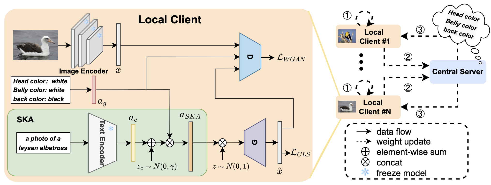

# Federated Zero-Shot Learning with mid-level semantic knowledge transfer
[Pattern Recognition 2024] This is the official repository for our paper: [Federated Zero-Shot Learning with mid-level semantic knowledge transfer](https://www.sciencedirect.com/science/article/pii/S0031320324005752) by Shitong Sun, Chenyang Si, Guile Wu and Shaogang Gong.

## Architecture 


## Installation
 ```python
conda create -n fzsl python==3.9
 ```

## Data Preparation

## Acknowledgement

This work is built upon：
+ [CLSWGAN](https://openaccess.thecvf.com/content_cvpr_2018/papers/Xian_Feature_Generating_Networks_CVPR_2018_paper.pdf) by Yongqin Xian.
+ [FedReID](https://www.eecs.qmul.ac.uk/~sgg/papers/WuGong_AAAI2021_FedReID.pdf) by Guile Wu.
+ [SKA](https://arxiv.org/pdf/2110.11384) by Shitong Sun.
+ [CLIP](https://arxiv.org/abs/2103.00020) by Alec Radford.
  
Thanks for their awesome work!

